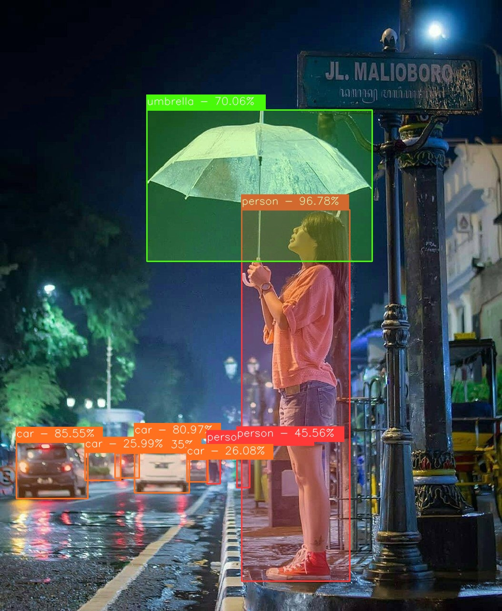

# YOLO-NAS ONNX

<p align="center">
    
</p>

**_Image Source_**: https://www.pinterest.com/pin/784752303797219490/

---


Run YOLO-NAS models with ONNX **without using Pytorch**. Inferencing YOLO-NAS ONNX models with ONNXRUNTIME or OpenCV DNN.

## Generate ONNX Model

Generate YOLO-NAS ONNX model. You can convert the model using the following code after installing `super_gradients` library.

```python
from super_gradients.training import models

net = models.get("yolo_nas_s", pretrained_weights="coco")
models.convert_to_onnx(model=net, input_shape=(3,640,640), out_path="yolo_nas_s.onnx")
```

## Custom Model

To run custom trained YOLO-NAS model in this project you need to generate custom model metadata.
Custom model metadata generated from [custom-nas-model-metadata.py](https://gist.github.com/Hyuto/f3db1c0c2c36308284e101f441c2555f)
to provide additional information from torch model.

**Usage**

```bash
python custom-nas-model-metadata.py -m <CHECKPOINT-PATH> \ # Custom trained YOLO-NAS checkpoint path
                                        -t <MODEL-TYPE> \ # Custom trained YOLO-NAS model type
                                        -n <NUM-CLASSES> # Number of classes
```

After running that it'll generate metadata (json formated) for you

## References

- https://github.com/Deci-AI/super-gradients
