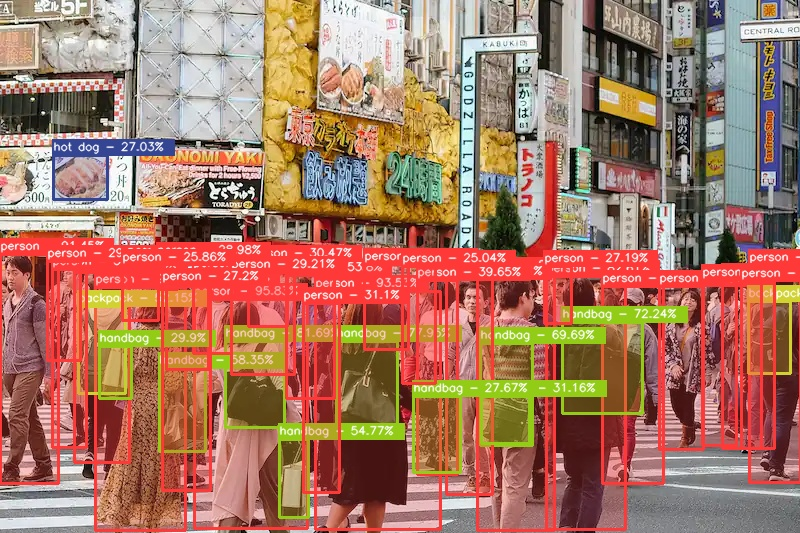

# YOLO-NAS ONNX with C++

<p align="center">
    
</p>

---

Inference yolo-nas onnx model using pencv `dnn`.

## CLI

**Inference on Image**

```bash
./yolo-nas-cpp.exe <YOLO-NAS-ONNX-MODEL-PATH> -I <IMAGE-INPUT-PATH>
```

**Inference on Video**

<p align="center">
    <video src="../assets/sample-vid-1.mp4"></video>
</p>

```bash
./yolo-nas-cpp.exe <YOLO-NAS-ONNX-MODEL-PATH> -V <VIDEO-INPUT-PATH>
```

Note: you can pass `int` as an index on `VIDEO-INPUT-PATH` to direct processing from webcam.

## Custom Trained YOLO-NAS Models

Run custom trained YOLO-NAS model.

1. Generate custom model metadata.

   Generate custom model metadata to provide additional information from torch model.
   Please follow these steps to generate it [Generate Custom Metadata](https://github.com/Hyuto/yolo-nas-onnx#custom-model).

2. Do inferencing

   Do inferencing as usual with additional `--custom-metadata` argument to pass the path metadata generated from previous step.

   **Example**

   ```bash
   ./yolo-nas-cpp.exe <YOLO-NAS-ONNX-MODEL-PATH> -I <IMAGE-INPUT-PATH> --custom-metadata <PATH-TO-METADATA>
   ```

## Run With GPU

Run OpenCV DNN with GPU, you need to build it from the source and enable CUDA. After that you can pass
`--gpu` args to do inferencing with GPU enabled.
