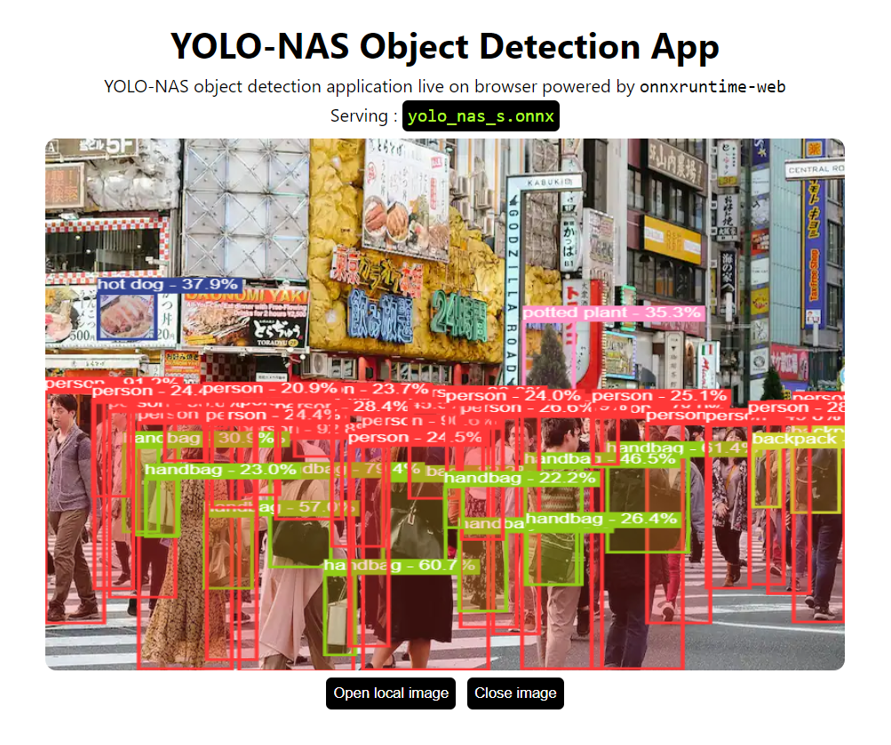

# YOLO-NAS with onnxruntime-web

<p align="center">
  
</p>


---

Object Detection application right in your browser.
Serving YOLO-NAS in browser using onnxruntime-web with `wasm` backend.

## Setup

```bash
yarn install # Install dependencies
```

**Copy YOLO-NAS to model directory**

1. Copy YOLO-NAS ONNX model to `./public/model`
2. Update `modelName` in `App.jsx` to new model name
   ```jsx
   ...
   // configs
   const modelName = "<YOLO-NAS-MODELS>.onnx";
   const configs = new Configs(
    [1, 3, 640, 640], // input shape
    0.25, // score threshold
    0.45, // IOU threshold
    100 // topk
    // custom metadata
   );
   ...
   ```
3. Done! 😊

### Custom Trained YOLO-NAS Models

1. Copy custom model metadata generated from [custom-nas-model-metadata.py](https://gist.github.com/Hyuto/f3db1c0c2c36308284e101f441c2555f) to `./public/model`, please follow [these steps](https://github.com/Hyuto/yolo-nas-onnx/tree/master/yolo-nas-py#custom-model) to generate metadata file using that script.
2. Update `modelName` and add custom-metadata args in configs at `App.jsx`
   ```jsx
   ...
   // configs
   const modelName = "<CUSTOM-TRAINED-YOLO-NAS-MODELS>.onnx";
   const configs = new Configs(
    [1, 3, 640, 640], // input shape
    0.25, // score threshold
    0.45, // IOU threshold
    100, // topk
    "<CUSTOM-TRAINED-YOLO-NAS-MODELS-METADATA>.json" // custom metadata
   );
   ...
   ```
3. Done! 😊

## Scripts

```bash
yarn start # Start dev server
yarn build # Build for productions
```

## Additional Models

**NMS**

ONNX model to perform NMS operator [CUSTOM].

[](https://netron.app/?url=https://raw.githubusercontent.com/Hyuto/yolo-nas-onnx/master/yolo-nas-web/public/model/nms-yolo-nas.onnx)

## Reference

- https://github.com/Deci-AI/super-gradients
- https://github.com/Hyuto/yolov8-onnxruntime-web
